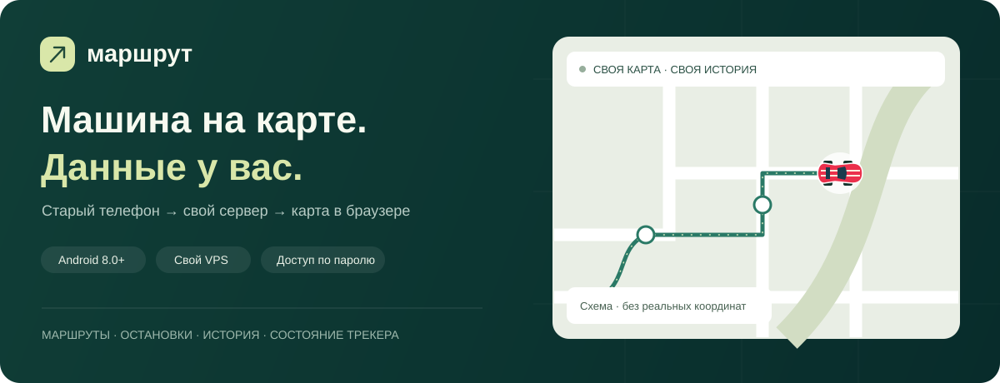
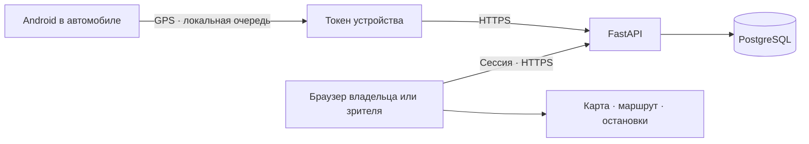

<p align="center">
  
</p>

# SafDecor · Маршрут — GPS-мониторинг автомобиля

Собственная система наблюдения за служебным автомобилем: **старый Android-телефон
становится GPS-трекером**, а владелец смотрит положение, маршрут и остановки в браузере.
Сервер разворачивается на своём VPS; доступ к истории — по паролю.

**[Скачать APK 1.0.2](https://github.com/Evgenii-Denisov2303/gps-tracker/releases/download/v1.0.2/fleet-tracker-1.0.2-test.apk)**
· **[Установить на телефон](docs/DOWNLOAD.md)**
· **[Развернуть сервер](docs/INSTALL_SERVER.md)**
· **[Все выпуски](https://github.com/Evgenii-Denisov2303/gps-tracker/releases)**

> Рабочий MVP. APK — тестовая сборка с debug-подписью. В нём нет встроенного сервера,
> пароля или токена: для подключения владелец выдаёт отдельный токен устройства.
> Карту смотрят через браузер; зрителям устанавливать APK не нужно.

## Автомобильный трекер START S-4011

Добавлен экспериментальный приёмник FLEX для доверенной сети: IMEI, архив,
текущие координаты и питание. Реальный прибор ещё не прошёл приёмку.
Защищённое подключение через обычную SIM к публичному VPS пока не реализовано.
[Поддержанный профиль, ограничения и настройка](docs/INSTALL_NAVTELECOM.md).
Android продолжает работать независимо от этой интеграции.

## Что умеет

| Возможность | Как работает |
|---|---|
| Текущее положение | Закрытая карта Leaflet / OpenStreetMap с обновлением примерно раз в 15 секунд |
| Поездки и история | Маршрут по датам, примерный пробег, скорость и интервалы движения |
| Остановки | От 5 минут в одной зоне, с подавлением GPS-дребезга |
| Контроль телефона | Сигнал связи без GPS, очередь, разрешения, батарея и зарядка |
| Работа без интернета | Телефон сохраняет точки и отправляет очередь после восстановления сети |
| Доступ зрителю | Отдельный аккаунт для карты и истории без управления устройствами |
| Удобный вход | Показать пароль, Caps Lock и сохранение входа на 30 дней по желанию |
| Моя остановка | Личная отметка на карте, сохранённая в браузере |
| Быстрый доступ | Возврат к машине и добавление сайта на главный экран |
| Свой сервер | FastAPI, PostgreSQL, миграции, Docker Compose и HTTPS через Caddy |

## Как устроено



Токен устройства разрешает **только отправку точек и диагностики телефона**. Пароль аккаунта используется
для входа на сайт. Установщик и открытый исходный код не дают доступа к чужим автомобилям.
Иллюстрация выше схематичная; реальная история и координаты здесь не опубликованы.

## С чего начать

- **Телефон уже подключают к готовой системе:** [скачать и настроить APK](docs/DOWNLOAD.md).
- **Нужно только смотреть автомобиль:** получить у владельца адрес сайта и аккаунт зрителя.
- **Нужна собственная система:** [развернуть VPS и HTTPS](docs/INSTALL_SERVER.md), создать машину и токен.
- **Хочется изучить код:** запустить локально по инструкции ниже и попробовать [симулятор](docs/TESTING.md).

## Для знакомства с кодом

```text
android/       Java · foreground service · SQLite-очередь · Android Keystore
backend/       FastAPI · SQLAlchemy · Alembic · API и тесты аналитики
web/           HTML / CSS / JavaScript · Leaflet · маркер SafDecor
deploy/        Caddy · HTTPS
docs/          Установка · API · тесты · ограничения
tools/         Генератор синтетической поездки
```

В проекте реализованы разделение прав владельца/зрителя, защита от повторной записи точек,
хранение офлайн-очереди, учёт часовых поясов и фильтрация GPS-скачков.
Проверки и их границы описаны в [STATUS.md](docs/STATUS.md); история версий — в [CHANGELOG.md](CHANGELOG.md).

## Быстрый локальный запуск

Требуются Git, Docker Engine/Desktop и Docker Compose v2:

```sh
git clone https://github.com/Evgenii-Denisov2303/gps-tracker.git
cd gps-tracker
cp .env.example .env
# Замените POSTGRES_PASSWORD случайной строкой HEX без пробелов.
docker compose -f docker-compose.yml -f compose.local.yml up -d --build
docker compose -f docker-compose.yml -f compose.local.yml exec api python -m app.cli admin owner
```

Windows PowerShell: `Copy-Item .env.example .env` вместо `cp`.
Генерация пароля БД: `python -c "import secrets; print(secrets.token_hex(32))"`.
Пароль владельца запрашивается интерактивно, минимум 12 символов; он не попадает в аргументы команд.
Откройте **http://localhost:8080**, войдите и нажмите «Добавить автомобиль».
Далее «Устройства» → «Выдать токен». Сохраните токен: сервер показывает его один раз.

Локальный HTTP доступен только этому компьютеру. Android намеренно требует HTTPS:
для испытания с реальным телефоном используйте VPS с действительным сертификатом.
Для проверки приёма точек без телефона есть [симулятор](docs/TESTING.md).
Не используйте локальный HTTP-режим для публичного сервера.

```sh
docker compose -f docker-compose.yml -f compose.local.yml ps
docker compose -f docker-compose.yml -f compose.local.yml logs --tail=100 api
docker compose -f docker-compose.yml -f compose.local.yml stop
# Запуск уже собранных контейнеров:
docker compose -f docker-compose.yml -f compose.local.yml start
```

`stop` сохраняет данные. **`down -v` удаляет том БД** — не используйте для обычной остановки.

## Android

Для установки готовой версии сборка не нужна: [скачать APK и прочитать инструкцию](docs/DOWNLOAD.md).

Android 8.0+ (API 26), target SDK 35; Google Play Services не требуются.
Нативное Java-приложение использует `LocationManager.GPS_PROVIDER`, foreground service,
постоянное уведомление, локальную SQLite-очередь и Android Keystore.
При движении сохраняет и отправляет точку примерно раз в 20 секунд;
после 5 минут стоянки — раз в 120 секунд. GPS остаётся включённым, чтобы заметить начало движения.
Повторные отправки используют прежний UUID и не удваивают пробег.
Отдельный сигнал связи примерно раз в минуту позволяет видеть состояние телефона без GPS.
Восстановление сети запускает отправку очереди; повторы ограничены задержкой до пяти минут.

Сборка через установленный Gradle 8.11.1 / JDK 17 / Android SDK 35:

```sh
cd android
gradle testDebugUnitTest lintDebug assembleDebug
```

Или из корня в изолированной среде Docker:

```sh
docker build -f android/Dockerfile --output type=local,dest=artifacts/android android
```

Сборка загружает официальные Android SDK и принимает лицензии SDK внутри контейнера.
Результат: `artifacts/android/fleet-tracker-debug.apk`.
Debug APK подходит для первого теста. Для постоянной установки соберите release APK
с собственным ключом в Android Studio; храните ключ отдельно, иначе обновление приложения
без удаления данных может стать невозможным. Публикация в Google Play не настроена.

## Установка и эксплуатация

- [VPS, поддомен, HTTPS, резервное копирование](docs/INSTALL_SERVER.md)
- [Телефон, разрешения, энергосбережение и испытания](docs/INSTALL_ANDROID.md)
- [API и единицы измерения](docs/API.md)
- [Тесты и симулятор](docs/TESTING.md)

Время в БД — UTC, дни и интерфейс — `TIMEZONE`, по умолчанию `Europe/Moscow`.
Интерфейс не зависит от часового пояса компьютера владельца.
Точки сортируются по времени GPS, а не по приходу на сервер.
Получение старой очереди не делает старую координату «свежей».

## Расчёты и пределы MVP

- Точность хуже 80 м, скорость выше 180 км/ч и невозможные скачки отбрасываются из маршрута.
- Пропуск более 180 секунд разрывает маршрут; пробег через такой разрыв не считается.
- Остановка: точки со скоростью до 3 км/ч в радиусе 50 м не менее 300 секунд.
  GPS-дребезг подавляется; уход в офлайн не продлевает остановку до настоящего времени.
- На границе дня используется небольшой контекст соседнего дня, длительность обрезается
  до выбранных суток. Время остановки — наблюдённое по точкам, не гарантированное время прибытия/выезда.
- GPS-пробег и время движения приблизительны, это не показания одометра и не дорожный маршрутизатор.
  Данные не привязываются к дорогам. Начало/конец суток без точек не считаются простоем.
- Порог устаревания 180 с, отсутствия GPS 600 с; меняются через `.env`.
- Интерфейс умеет выбирать зарегистрированные машины. Есть владелец и зритель;
  изоляция разных организаций, сложные роли и аналитика большого автопарка не входят в MVP.
  Используйте один активный телефон на машину; при замене отзовите старый токен.
- Отозванный токен перестаёт принимать точки, история сохраняется.
- Нет автоматической очистки истории. При необходимости явно запустите `python -m app.cli prune --days 180`.
- При потере соединения очередь телефона не удаляется. Если памяти нет, приложение показывает ошибку;
  оставьте свободное место и проверьте очередь перед поездкой. Удаление приложения уничтожит локальную очередь.
- После force-stop Android блокирует автозапуск до ручного открытия; ограничения производителя
  могут остановить даже foreground service. Обязателен реальный тест выбранного телефона.
- Сервер не может получить координату при отсутствии GPS, питания или интернета. Сигнализация
  на сайте показывает последнее известное состояние, уведомления владельцу вне сайта — следующий этап.

## Безопасность

Пароли — Argon2id. Сессия — случайный непрозрачный токен в HttpOnly/SameSite=Strict cookie;
в БД хранится SHA-256 токена. Срок сессии 12 часов, logout отзывает её на сервере.
Изменяющие административные запросы требуют CSRF-токен и точное совпадение Origin.
Устройства имеют отдельные случайные токены (в БД только SHA-256), доступ к карте ими невозможен.
История, маршруты, остановки, список автомобилей и устройств защищены авторизацией.
Вход ограничен по логину и адресу, счётчики сохраняются в БД и обновляются атомарно.
Приложение не доверяет произвольному `X-Forwarded-For`; за прокси общий лимит действует на кабинет в целом.
API ограничивает размер запроса 512 КиБ, пакет — 500 точек. JSON-секреты и координаты не логируются.
`.env`, ключи подписи и локальные пароли исключены из Git. PostgreSQL не публикует порт на хост.

До использования уведомите сотрудников о мониторинге служебного автомобиля и установите
правила доступа и хранения данных. Резервные копии содержат историю местоположений.

## Зависимости и внешние сервисы

| Компонент | Зависимости / внешние соединения |
|---|---|
| API | Python 3.12 (разработка также 3.10+), FastAPI, Uvicorn, SQLAlchemy, Alembic, psycopg, pydantic-settings, argon2-cffi, tzdata; версии в requirements.txt |
| БД | PostgreSQL 17, постоянный Docker volume |
| Сайт | HTML/CSS/JS, Leaflet 1.9.4 (BSD-2-Clause), Nginx; JS/CSS карты обслуживаются локально, без внешнего CDN |
| HTTPS | Caddy 2, ACME CA для выпуска/продления бесплатного сертификата; домен и порты 80/443 должны быть доступны |
| Карта | Растровые тайлы `https://tile.openstreetmap.org`, данные OpenStreetMap / ODbL |
| Маркер автомобиля | Собственный векторный рисунок `web/car.svg`; размер зависит от масштаба карты, внешних запросов нет |
| Android | Android SDK / Gradle / Android Gradle Plugin для сборки; во время работы только свой HTTPS-сервер, без Google Play Services и аналитики |
| Тесты | pytest, httpx, JUnit; браузерные проверки выполняются на локальном сайте |
| Сборка | Docker Hub, PyPI, npm, Google Maven, Maven Central, Gradle Plugin Portal и dl.google.com |

**OpenStreetMap:** данные открытые, но публичный сервер тайлов не является безлимитным
коммерческим хостингом: нет SLA и гарантированной числовой бесплатной квоты.
Сохраняйте атрибуцию, штатный браузерный кэш и Referer; не скачивайте тайлы массово
и не создавайте офлайн-пакеты. При росте нагрузки выберите провайдера или свой tile server.
Тайловый сервер видит IP браузера, Referer домена и запрошенные квадраты карты;
токен устройства и история точек туда не отправляются.
Условия: https://operations.osmfoundation.org/policies/tiles/ .
При замене провайдера обновите URL и CSP в `web/app.js`, `web/nginx.conf`, `backend/app/main.py`.
Обратное геокодирование отключено; запросов к Nominatim нет. Платные API не используются.

## Дальнейшие шаги

Геозоны, уведомления вне сайта, MAX-интеграция, адреса остановок, недельные отчёты
и экспорт — возможное развитие, в текущий MVP не входят.

Ошибки и предложения можно описать в [Issues](https://github.com/Evgenii-Denisov2303/gps-tracker/issues).
Укажите версию приложения, Android и шаги воспроизведения. Не прикладывайте токены,
пароли или настоящую историю перемещений; подробнее — [SECURITY.md](SECURITY.md).

Ограничения Android: https://developer.android.com/develop/background-work/services/fgs/service-types
и https://developer.android.com/develop/background-work/services/fgs/restrictions-bg-start .


### Удобства веб-кабинета SafDecor

- На экране входа: показать/скрыть пароль, подсказка Caps Lock и сохранение входа на 30 дней по отдельной галочке. «Выйти» завершает сессию на сервере.
- «К машине» возвращает карту к последней полученной GPS-точке; свежесть сигнала отображается отдельно.
- «Моя остановка» → «Выбрать на карте» → нажмите в месте посадки → введите название → «Сохранить». Отметку можно показать, изменить или убрать. Она хранится в localStorage этого браузера отдельно для логина и автомобиля, не меняет общий маршрут и не рассчитывает ETA.
- «На главный экран» внизу страницы запускает установку, если браузер её предлагает, либо показывает инструкцию для Android, iPhone и компьютера. Для работы нужен интернет; service worker и офлайн-кэш координат не используются. Условия установки: [MDN](https://developer.mozilla.org/en-US/docs/Web/Progressive_web_apps/Guides/Making_PWAs_installable).
- Исходные фотографии бренда из личной почты не включены в репозиторий.

Эти изменения относятся к сайту. Переустанавливать Android-приложение трекера не нужно.

### Фирменное оформление

Цветовая палитра и логотип взяты с официального сайта [SafDecor](https://safdecor.ru/). Логотип является фирменным обозначением SafDecor; лицензия исходного кода не предоставляет права на товарный знак. Для собственного проекта замените его своим. Montserrat хранится локально в `web/fonts`, лицензия SIL OFL 1.1 приложена; запросов к Google Fonts при открытии сайта нет.
